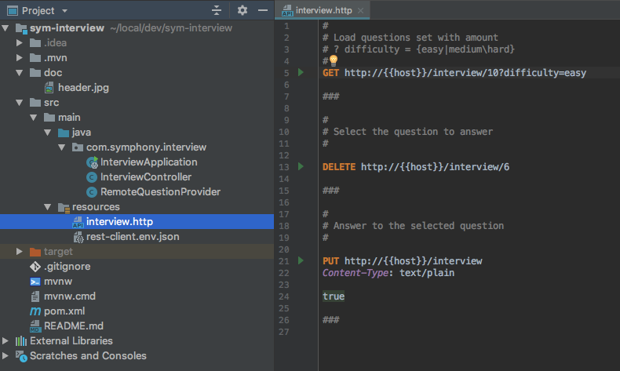
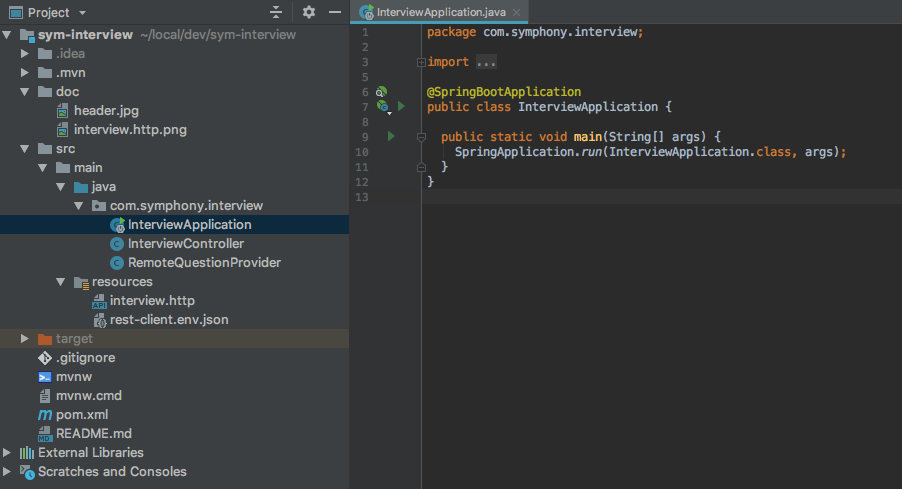

# SymInterview

### Purpose 
Rodrigo, our last trainee has just finished his 2 months internship a few weeks ago. 
We asked to Rodrigo to develop a small REST API that would be used to simplify our hiring process. 
This API is composed by 3 distinct services : 
1. Load the question set, by defining the amount of questions to load and optionally their complexity 
2. Select the question to answer
3. Answer the question

Right before leaving the office, Rodrigo told us that it was possible to play with the API (once the SpringBoot application started) 
using the file `interview.http` versioned with the project : 

Within Rodrigo, it's quite easy to start the application, you simply have to run the Main class `InterviewApplication.java` : 

### Your mission
Rodrigo finished its job in time, but we never had enough time to review the code he developed during these 2 months.
Today we now have to push its code to production, but the tech lead asked you to check if all is ok.

Your mission, if you choose to accept it, is to quickly make Rodrigo's code ready to prod. You are free to refactor it 
as much as you want and make it greater !